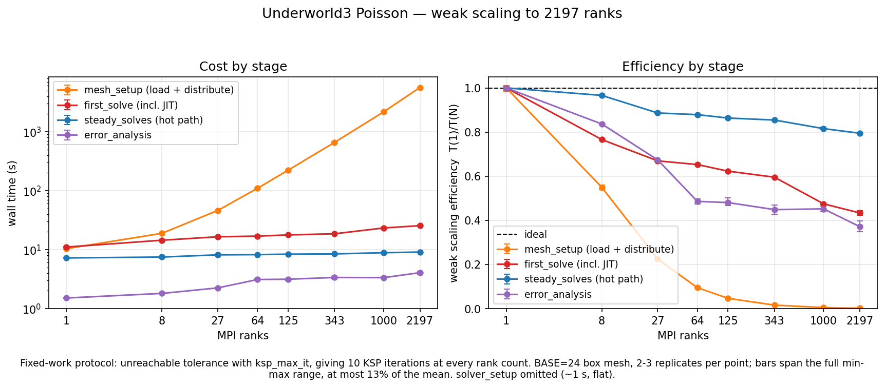
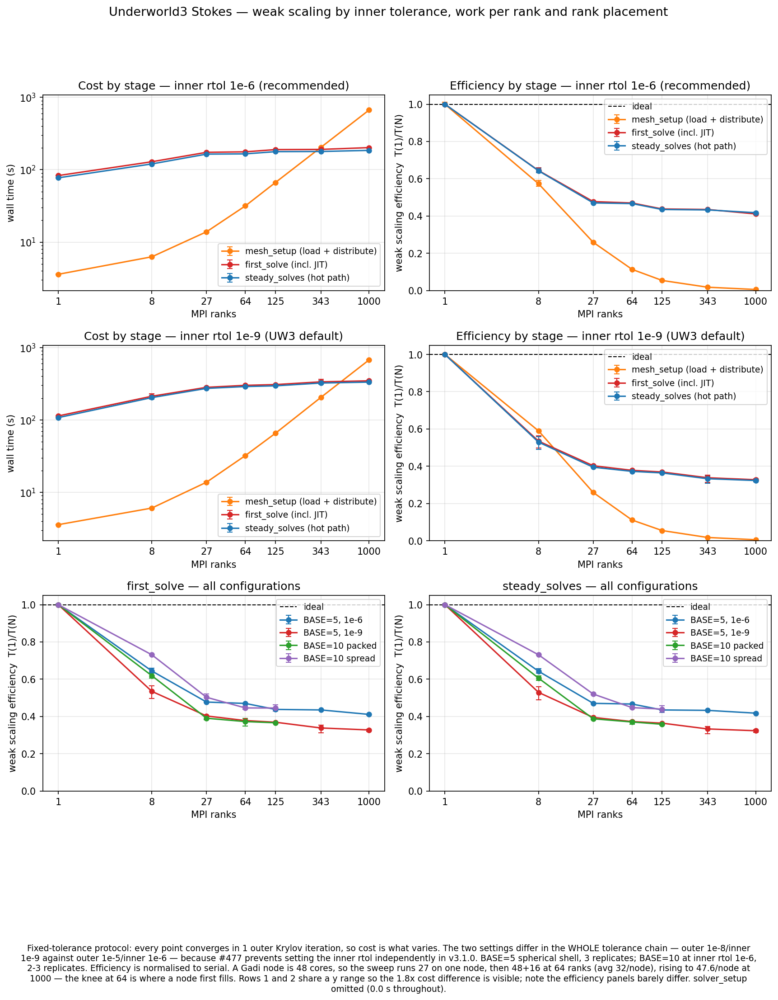
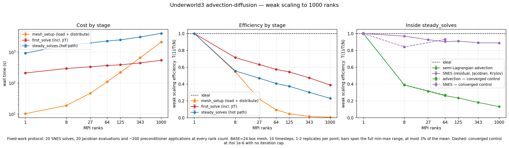
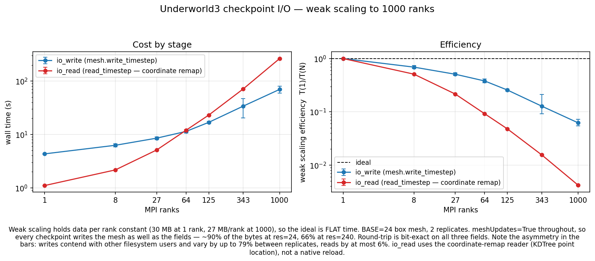
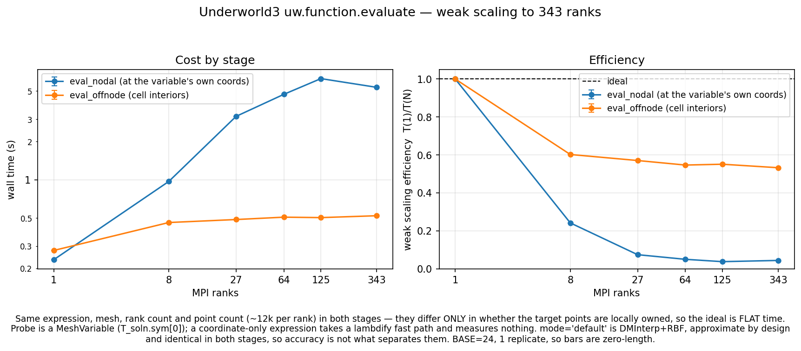

# Underworld3 weak-scaling characterisation

**UW3 v3.1.0** · **Benchmark v1** · **Gadi (NCI)** · August 2026

Weak-scaling benchmarks for [Underworld3](https://github.com/underworldcode/underworld3),
run once per release. Each round characterises one release: a fixed UW3 version, PETSc
version and container image and is frozen into [`reports/`](reports/) when the environment
changes. Revised conclusions are in [CHANGELOG.md](CHANGELOG.md).

Protocol: `NTASKS = i³`, `res = BASE × i`, so elements per rank are constant and the ideal
is a **flat** curve.

## Findings

In the order the results are presented below.

| # | Finding | Evidence |
|---|---|---|
| | **Poisson** | |
| 1 | Mesh distribution dominates for a cheap solver | `mesh_setup / steady_solves` = 1.4 at 1 rank, **620 at 2197** |
| | **Stokes** | |
| 2 | **The parallel penalty is paid filling the first node, then efficiency flattens** — consistent across all four Stokes configurations. The steep loss is 1 → 27 ranks, entirely within one 48-core node; adding nodes beyond that costs little | from 27 ranks to the largest run all four configurations retain 0.82–0.92 (e.g. 1e-6: 0.47 → 0.42 over a 37× rank increase) |
| 3 | Two levers move the level but not the shape — solve tolerance and memory bandwidth per rank | loosening the tolerance chain (outer 1e-8/inner 1e-9 → 1e-5/1e-6): 1.8× faster, residual 2.2e-8, reductions 5731 → 2981. `--map-by node`, ~3.4× bandwidth per rank: efficiency 0.36 → 0.44 at 125 ranks, nothing at serial — about a fifth of the loss, the rest being communication |
| | **Advection–diffusion** | |
| 4 | Semi-Lagrangian advection does not scale, and is still climbing at 1000 ranks | SLCN 460.6 → 3496.0 s (eff 0.13) with solver work pinned; SNES in the same stage holds 0.89 |
| 5 | A third of a serial SLCN timestep loop is a fallback projection — legitimate, since a derivative cannot go through `evaluate`, but invisible to users | `SNES_MultiComponent.solve` 326.9 s vs `SNES_Scalar.solve` 156.2 s at 1 rank |
| 6 | Jacobian re-assembled every timestep on constant operators | `SNESJacobianEval` 282.7 s for 20 evaluations at 1 rank, where 2 would do |
| | **Checkpoint I/O and `evaluate`** | |
| 7 | `read_timestep` does not scale — but it is a coordinate-remap reader (rank-0 file read, swarm migration, per-rank KDTree), not a field read. `write_timestep` degrades gracefully | read 1.1 → 263.4 s (eff 0.004) against write 4.3 → 69.7 s (eff 0.06); the native `read_checkpoint()` path was not measured |
| 8 | `evaluate` at a variable's own coordinates collapses | 19 → 471 µs/pt (eff 0.05) vs 22.5 → 45.8 µs/pt at cell interiors (eff 0.56) |
| | **v3.1.0 release artefacts** — present in the released container, not in UW3 main | |
| 9 | `cache=False` in `SNES_Stokes_SaddlePt._build()` disables the JIT cache | 5.8 s serial → 13.6 s at 1000 ranks; commit `2d3a0895` |
| 10 | `solve()` overwrites user-set options — already fixed upstream (#477) | `snes_max_it` 3 → 50, inner rtols reverted |
| 11 | 32-bit PETSc indices cap the container at 2197 ranks; `--with-64-bit-indices` would lift it | `2147483650 is too big for PetscInt` at 4913 ranks |

## Poisson



Fixed-work: unreachable tolerance with `ksp_max_it`, giving exactly 10 KSP iterations at
every rank count. BASE=24 box mesh, 2–3 replicates.

| stage | 1 rank | 2197 ranks | eff (serial) |
|---|---|---|---|
| `mesh_setup` | 10.4 s | **5621 s** | 0.002 |
| `first_solve` | 11.0 s | 25.5 s | 0.43 |
| `steady_solves` | 7.2 s | 9.1 s | **0.79** |
| `error_analysis` | 1.5 s | 4.1 s | 0.37 |

The solver scales at 0.79 against serial, 0.90 against the 64-rank job — and it does not
matter: at 2197 ranks UW3 spends 5621 s distributing the mesh against 9 s solving, growing as
`t = 0.784 × N^1.152`.

**Caveat.** The script advertises `k = 1 + u²`, but under fixed work SNES aborts before
updating, so `u` stays zero and the operator is a constant-coefficient Laplacian. A control
run seeding `u` with the analytic solution changed `steady_solves` by ≤0.1% and
`SNESJacobianEval` by ≤0.3%, so the timings stand — the operator simply is not the nonlinear
one described.

## Stokes



Fixed-tolerance: every point converges in 1 outer Krylov iteration, so cost is what varies.
BASE=5 spherical shell, 3 replicates; BASE=10 at inner rtol 1e-6. UW3 derives the inner
fieldsplit rtol from the outer one and the container's `solve()` overwrites any independent
setting, so the inner value had to be controlled by moving the outer.

| label | outer rtol | inner rtol | achieved residual | eff @1000 |
|---|---|---|---|---|
| 1e-9 (UW3 default) | 1e-8 | 1e-9 | 2.6e-11 | 0.323 |
| 1e-6 (recommended) | 1e-5 | 1e-6 | 2.2e-8 | **0.418** |
| 1e-3 | 1e-2 | 1e-3 | 2.5e-5 | — |

Tolerance is a constant-factor cost, not a scaling defect: cost is offset by ~1.8× while the
efficiency curves are near-identical, and loosening cuts global reductions from 5731 to 2981
per solve at 125 ranks.

A separate effect, independent of tolerance, sets the shape of those curves: the parallel
penalty is paid filling the first node. The steep loss (1 → 27 ranks) sits entirely within one
48-core node, and beyond it the curve is nearly flat — 0.47 → 0.42 over a 37× rank increase.
All four configurations do this, at both tolerances and both BASE=10 placements, each
retaining 0.82–0.92 across that range. The consistency points to a fixed parallelisation
overhead paid while the first node fills, rather than to anything configuration-specific.

More memory bandwidth per rank somewhat helps. Spreading a BASE=10 job with `--map-by node`
gives each rank ~3.4× the bandwidth (14 ranks/node instead of 48) and lifts efficiency from
0.36 to 0.44 at 125 ranks, while changing nothing at serial. It recovers roughly a fifth of
the loss and no more: BASE=5, whose ~1 GB per rank was never starved, sits at the same 0.44.
The rest is communication and synchronisation, which bandwidth cannot remove.

## Advection–diffusion



Fixed-work: 20 SNES solves, 20 Jacobians, ~200 preconditioner applications at every rank
count. BASE=24, 10 timesteps.

| ranks | SLCN | SNES | SLCN share |
|---|---|---|---|
| 1 | 460.6 s | 462.2 s | 50% |
| 1000 | **3496.0 s** | 520.5 s | **87%** |
| efficiency | **0.13** | 0.89 | |

SLCN is not timed directly. PETSc times `SNESSolve`, and the stage covers the whole timestep
loop, so the semi-Lagrangian work, characteristic tracing and interpolation, is simply
what is left over: **SLCN = `steady_solves` − `SNESSolve`**. Both are rank-0 times, so the
subtraction does not mix a max-across-ranks total with a single-rank event. Note this puts
the projection below on the SNES side of the split, not the SLCN side.

Form evaluation and Krylov scale nearly perfectly. The semi-Lagrangian step does not, and
shows no plateau. It is **not** collectives: reductions are flat (+8% over a 125× rank
increase) and message volume grows 1.7×, but point-to-point message *count* grows **7.2×**
(74 835 → 540 771), tracking the cost. The cause is **not established**.

The right-hand panel shows it is protocol-independent: a converged control lands on the same advection
curve with only the SNES half shifted.

**Two thirds of the "SNES" curve is not the solve.**

| ranks | `SNES_Scalar.solve` | `SNES_MultiComponent.solve` (projection) |
|---|---|---|
| 1 | 156.2 s | **326.9 s** |
| 1000 | 180.8 s | 366.8 s |

`SNES_AdvectionDiffusion.solve` calls `super().solve()` once per timestep; the second PETSc
`SNESSolve` comes from the history term. `SemiLagrangian._record_current_field_into_history`
evaluates the flux `κ∇u`, which contains a derivative, so `evaluate` raises and an
`except Exception` branch runs a full projection instead. `SNESLineSearch` = 10 against
`SNESSolve` = 20 confirms it. This is characterisation, not a defect — a derivative cannot go
through `evaluate`.

## Checkpoint I/O



Data per rank is constant (30.2 → 27.1 MB/rank), so the ideal is **flat time**.

| ranks | written | `write_timestep` | `read_timestep` | read/write |
|---|---|---|---|---|
| 1 | 30 MB | 4.3 s | 1.1 s | 0.25 |
| 64 | 1.8 GB | 11.4 s | 12.0 s | 1.05 |
| 1000 | 27 GB | 69.7 s | **263.4 s** | **3.78** |

**The two stages are not symmetric, and the read is not an I/O measurement.**
`mesh.write_timestep()` writes the mesh and all three fields in one call.
`MeshVariable.read_timestep()` is the *coordinate-remap* reader: rank 0 reads the file, saved
`(coord, value)` pairs migrate to the ranks that own them, each rank runs a local KDTree
against what it received, and interpolated values migrate back. It exists for reloading onto
a *different* mesh.

So the read stage times point location and swarm migration, and its collapse (efficiency
0.004 at 1000 ranks) likely shares a mechanism with the `evaluate` result below. For
same-mesh reload — which is what this benchmark does — UW3 provides `read_checkpoint()`, a
native PETSc DMPlex path. It was not measured.

`io_write` replicates disagree by up to **79%** (reads ≤6%), because writes contend with
other filesystem users. `meshUpdates=True` throughout, so every checkpoint writes the mesh as
well as the fields — most of the bytes, ~90% at res=24 and 66% at res=240. Round-trip is
bit-exact on all three fields, which same-mesh nearest-neighbour matching guarantees.

## `uw.function.evaluate`



Same expression, mesh, rank count and point count (~12k/rank); the stages differ only in
whether target points are locally owned.

The cost per point inverts. At one rank, evaluating at a variable's own coordinates is
slightly *cheaper* than at cell interiors (19.1 against 22.5 µs/pt); by 343 ranks it is 10×
more expensive (470.6 against 45.8). The effect is purely distributed — nodal points sit
exactly on cell vertices, so under partitioning many fall on a rank boundary and are ambiguous
about which cell, and therefore which rank, owns them. The interior probes sit half a cell
inside, strictly within one cell and one rank.

UW3's own semi-Lagrangian code documents that mechanism and routes around it, noting that
on-vertex sampling under MPI *"mis-locates at a process seam (first-pass `get_closest_cells` +
FE extrapolation), seeding a spurious history value"* (`systems/ddt.py:2224`) — so the
ambiguity yields **wrong values**, not merely slow ones, and its fix is to copy the variable's
nodal data directly instead of evaluating. That workaround is local to the semi-Lagrangian
path: a user writing `evaluate(var.sym[0], var.coords)` gets no protection and no warning. The
finding is a sharp edge in the public API, **not** UW3's internal hot path.

Both stages run `mode="default"` (DMInterp+RBF, approximate by design), so accuracy is not
what separates them — only where the points sit.

## Measurement pitfalls

Each of these produced a wrong conclusion here before being caught.

- **Baseline choice moves Stokes from 0.32 to 0.87.** Ranks-per-node across an `i³` sweep is
  1, 8, 27, 48, 48, 48, 48, so low-rank points measure node occupancy. Every efficiency panel
  shows both baselines; full occupancy is *derived* from the sweep's own maximum
  ranks-per-node, since Gadi packs 48 and Setonix 128.
- **A larger per-rank working set flatters its own serial baseline** — the same trap, and why
  "work per rank scales worse" looked true.
- **Per-node memory footprint** sets the bandwidth regime, not work per rank or placement
  separately. PBS enforces memory per node.
- **`PCApply − 1`** is a valid Krylov-iteration proxy for scalar solvers; it reads 0 for
  nested ones, because PETSc folds inner `KSPSolve` calls into the outer counter.
- **PETSc's FLOP column is per rank** — do not divide by `nprocs`. Stage time must be the max
  across ranks. Event counts differ ~100× between ranks under AMG consolidation.
- **Reduction counts miss non-PETSc MPI** — direct `MPI_*` calls in Python do not appear.
- **An unreachable tolerance is safe for scalar solvers and poisons nested ones.** For Stokes,
  UW3 derives inner tolerances from the outer one, so at 1e-50 neither inner KSP can converge;
  with a matrix-free Schur complement every pressure iteration triggers a full velocity solve.
  This hung the campaign for days.
- **A nonlinear benchmark can silently measure a linear operator.** `zero_init_guess` is
  tri-state, defaulting to auto-detect → `True` on a cold solver, which discards any initial
  state written beforehand.
- **JIT lands in whichever stage touches an expression first** — without an untimed warm-up
  the first timed stage absorbs it, which once inverted an I/O comparison.

## Running a campaign

```bash
vi params.sh                        # set the campaign
bash scaling_test_job_launcher.sh   # one job per JOBS × RUN_INDICES
```

**Adding a parameter takes three places.** Miss one and the job silently uses the default
rather than failing — this cost a five-job campaign:

1. `params.sh` — `export UW_THING=...`
2. `gadi_{container,baremetal}_go.sh` — `-uw_thing ${UW_THING:-default}`
3. `scaling_test_job_launcher.sh` — add `UW_THING` to `EXPORTVARS`

**Protocol choice.** Fixed-work (unreachable tolerance + `ksp_max_it`) holds iteration count
constant, so efficiency is not confounded by conditioning growth; use it for scalar solvers.
Fixed-tolerance (reachable rtol) lets every point converge; use it for nested solvers, where a
derived inner tolerance makes the unreachable variant pathological.

**Before spending service units:** run serial first (catches a hang for ~1 SU, not 50); check
`PCApply` is flat across the sweep (scalar solvers only — for nested ones it is a
degenerate 1 regardless); check `ranks_per_node` matches intent; confirm the mesh is
in `MESH_CACHE`; and if running a bind-mounted source tree, print `uw.__file__` — a failed
`PYTHONPATH` shadow silently runs the image's copy.

```bash
python3 analysis/export_data.py --round <label> --uw3-version ... --site gadi
python3 analysis/fig_poisson.py      # and the other fig_*.py
python3 analysis/archive_round.py --round <label> --dry-run
```

## How results are stored

Raw PETSc logs are 5.8 GB — one 2197-rank `timing.csv` is 423 MB, since PETSc writes a row per
(stage, event, **rank**). `/scratch` is purged, so raw output is ephemeral and gitignored.

Committed instead is the reduction the figures consume — **3.2 MB**:

```
data/<round>/{manifest.json, runs.csv, stages.csv, events.csv, info.json}
```

`figdata.load()` prefers `data/`, then archived rounds, then raw. All five figures regenerate
byte-identically from the CSVs, so archived figures stay reproducible without Gadi.

**Lossy in one way:** per-event max/min across ranks and rank 0's time are kept, but not
per-rank rows — a histogram across 2197 ranks could not be rebuilt. Keep raw until a round
closes.

**`benchmark_version`** guards cross-release comparison, which is only valid while the
benchmark measures the same work. Bump it when a model script changes what it measures. This
round is **v1**; nothing earlier is comparable.

## Archive

| round | release | benchmark | site |
|---|---|---|---|
| *(open)* `2026-08_uw3-v3.1.0` | v3.1.0 | 1 | Gadi |

## Open questions

- **SLCN mechanism** — message count grows 7.2× while volume grows 1.7× and collectives are
  flat. Cause not established.
- **`eval_nodal` growth** — 25× per point to 343 ranks; the distributed component is
  responsible, the specific operation is not identified.
- **`error_analysis` grows 2.7×** with flat, negligible communication. Recorded as a curiosity.
- **Should `evaluate` short-circuit at a variable's own nodes?** The logic exists in
  `ddt.py` (detect a single mesh-variable component, copy `var.data`, skip point location) but
  only the semi-Lagrangian caller is protected. Promoting it into `uw.function.evaluate` needs
  a strict check that the supplied coordinates really are that variable's own, since a false
  positive would silently return the wrong array; documenting it is the zero-risk fallback.
- **`read_checkpoint()` unmeasured** — the native same-mesh reload path. This campaign timed
  the coordinate-remap reader instead, so UW3's actual restart cost is unknown.
- **Setonix** — would separate "UW3 does this" from "Gadi does this". Blocked on
  `setonix_baremetal_go.sh` (absent) and a Setonix container.
